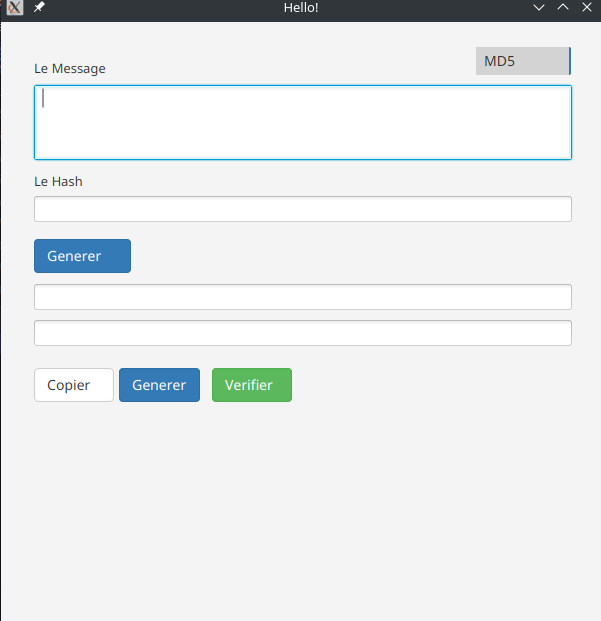
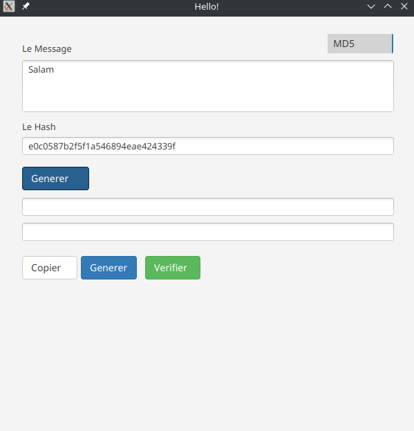
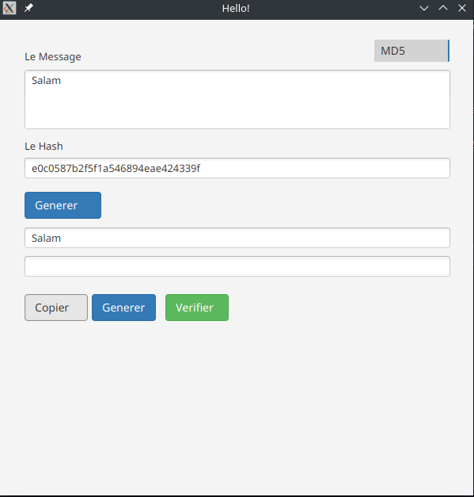
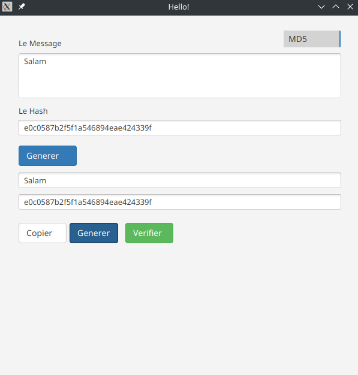
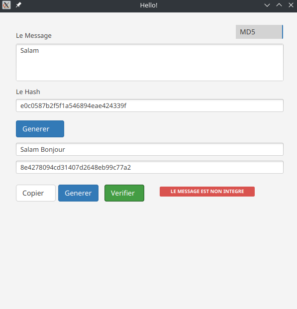
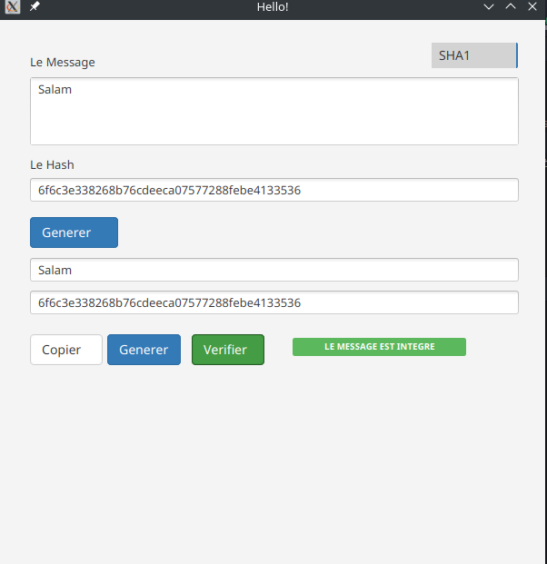

# Projet Fin module Security

Ce projet est mon projet fin de module "Security des systemes infromatique"

### Les dependances
    JDK 11 : Java Devolepement Kit version 11
    JavaFX : Une librairie des interface graphique cross-platform
    BootsrapFX : Une librairie des classes CSS predefinies
### Prototype d'application

